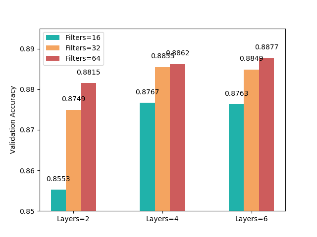
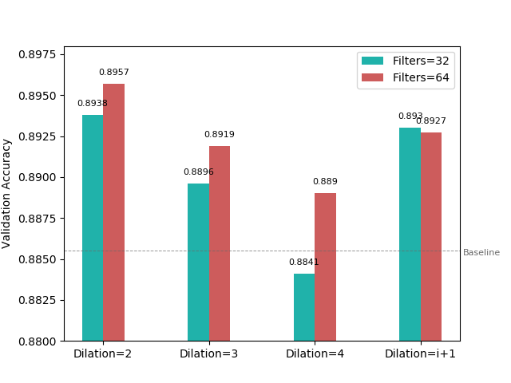
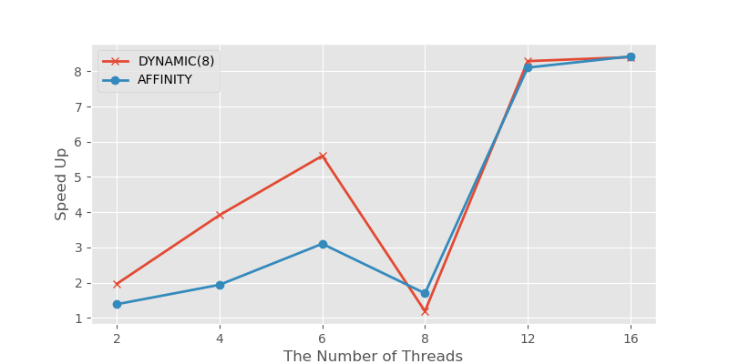
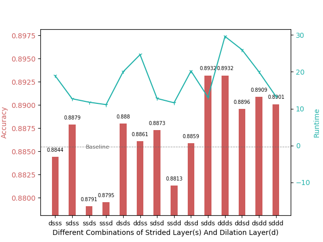
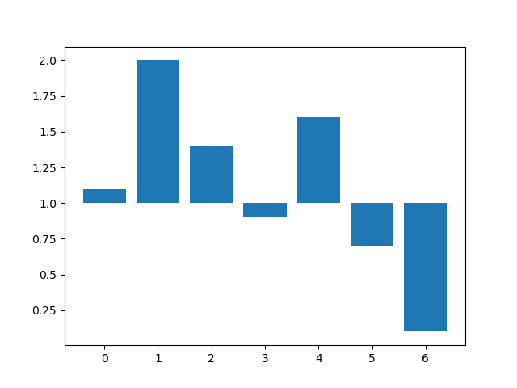
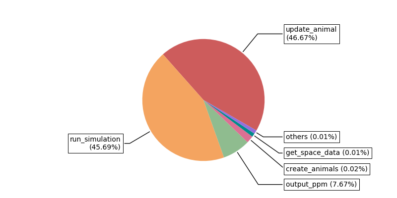

# python_plot
python plot codes collected by myself. Updating...

### Bar Chart

<table style="width:100%; table-layout:fixed;">
  <tr>
    <td>
        
    </td>
    <td></td>
    <td></td>
  </tr>
  <tr>
    <td align="center"><a href="https://github.com/gzrjzcx/python_plot/blob/master/sourcecode/bar/single_bar.py">single bar</a></td>
    <td align="center"><a href="https://github.com/gzrjzcx/python_plot/blob/master/sourcecode/bar/double_bar.py">double bar</a></td>
    <td align="center"><a href="https://github.com/gzrjzcx/python_plot/blob/master/sourcecode/bar/triple_bar.py">triple bar</a></td>
  </tr>
  <tr>
    <td></td>
  </tr>
  <tr>
    <td align="center"><a href="https://github.com/gzrjzcx/python_plot/blob/master/sourcecode/bar/double_baseline_bar.py">double baseline bar</a></td>
  </tr>
</table>

### Line Graph

<table style="width:100%; table-layout:fixed;">
  <tr>
    <td></td>
  </tr>
  <tr>
    <td align="center"><a href="https://github.com/gzrjzcx/python_plot/blob/master/sourcecode/line/simple_2line.py">simple 2 line</a></td>

  </tr>
</table>

### Complex Chart

<table style="width:100%; table-layout:fixed;">
  <tr>
    <td></td>
  </tr>
  <tr>
    <td align="center"><a href="https://github.com/gzrjzcx/python_plot/blob/master/sourcecode/complex/complex_1.py">bar+line+baseline+2-y</a></td>
  </tr>
</table>

### Other Chart

<table style="width:100%; table-layout:fixed;">
  <tr>
    <td></td>
  </tr>
  <tr>
    <td align="center"><a href="https://github.com/gzrjzcx/python_plot/blob/master/sourcecode/other/baseline.py">baseline</a></td>
  </tr>
</table>

### Pie Graph

<table style="width:100%; table-layout:fixed;">
  <tr>
    <td></td>
  </tr>
  <tr>
    <td align="center"><a href="https://github.com/gzrjzcx/python_plot/blob/master/sourcecode/pie/pie_1.py">Pie 1</a></td>
  </tr>
</table>